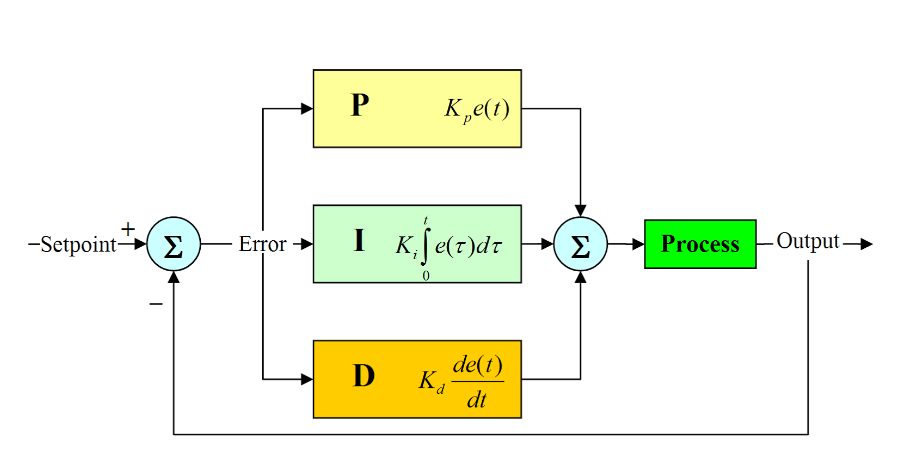

<h1 align="center"> Floating Ball Control </h1>

## Descrição do Projeto

### Overview

This project was devised for the Mechatronic Systems Project II course (SEM0542) offered by EESC-USP. All programming files were exclusively crafted within the scope of this course for educational purposes. The primary aim of this system is to engineer a mechatronic setup capable of regulating the height of a ball using various sensors and a fan. In this configuration, the setpoint is determined through a distance sensor, employing measurements acquired from hand gestures.

## Organization

The project was maded for the microcontroller ESP32 using the [ESP-IDF](https://docs.espressif.com/projects/esp-idf/en/latest/esp32) and [PlatformIO](https://platformio.org/) frameworks. 

Below, we have the files struct.
- **main**: Main file 
- **lib**: Developed packages
    - **actuators**: H-Bridge driver (L298 N)
    - **ultrassonic**: Ultrassonic sensor driver (HC-SR04)
    - **pid_ctrl**: PID controller
    - **mov_average**: Moving Average Filter

- **components**: ESP-IDF extra drivers
    - **ESP32_VL53L0X**: Laser sensor driver (VL53L0X)
    - **esp_idf_lib_helpers**: ESP-IDF version driver

### Operation

The controller operates based on the logic of a PID controller.

We can define the own system, defining the inputs and outputs:

- **Inputs**
    - Setpoint: Derived by applying a moving average filter to ultrasonic measurements of a hand's height.
    - Feedback: Determined by measuring the height of the ball using the laser sensor.

- **Output**: The PWM signal is sent to the H-Bridge to adjust the speed of the fan motor.
